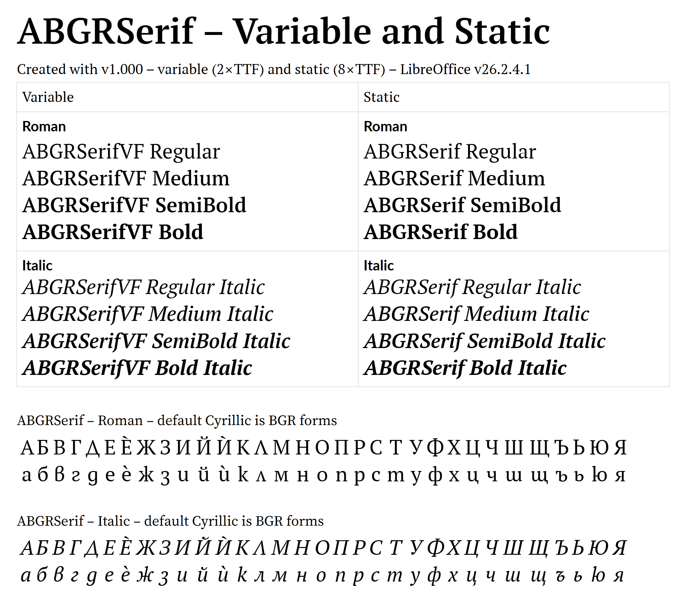
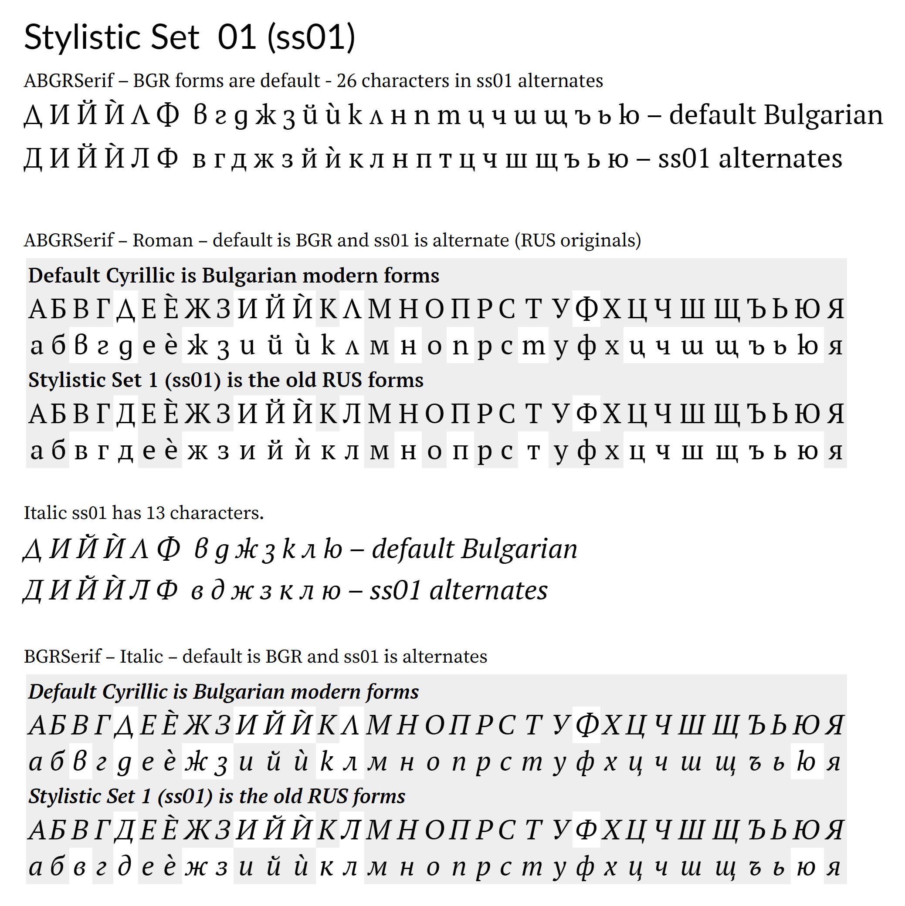

ABGRSerif is a BGR serif font based on the PTSerifBGR web fonts found on the **_Official spelling dictionary of the Bulgarian language_** website (https://beron.mon.bg/). Those fonts were modified to make modern Bulgarian letter forms the default Cyrillic characters, and the old forms were moved to Stylistic Set 01 (`ss01`).  
Those fonts were just the four RIBBI fonts which I have converted into variable fonts, and added Medium and SemiBold weights.  
Since they were web fonts the character set is rather limited.  
This project was sort of a test run for converting the full GF fonts into variable fonts.  
The BGR characters in these fonts will be added as a localization (`loclBGR`) in the full versions.  

Formats included: OpenType-PS and OpenType-TT, variable and static, `.otf` and `.ttf` files. All those formats are included in the release ZIP file.    
   
Download ZIP here:  
https://github.com/kenmcd/ABGRSerif-Font/tree/master/releases  
GitHub kept rejecting the ZIP upload on the Release page (with no explanation), so I just uploaded it to a folder.   

    
    
